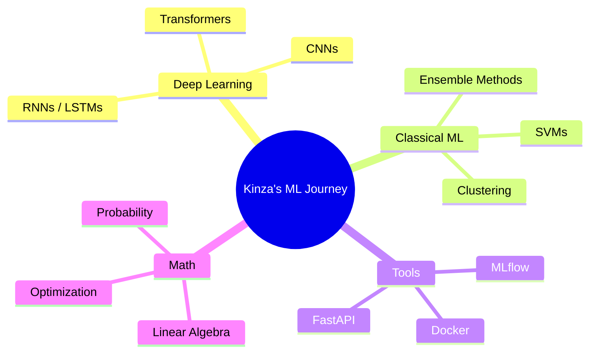

<div align="center">

<!-- Animated Header -->


<!-- Typing Animation -->
[](https://git.io/typing-svg)

<br/>

<!-- Social Badges -->
[](https://www.linkedin.com/in/syedakinzabatool)
[](https://www.kaggle.com/syedakinzabatool)
[](https://medium.com/@syedakinzabatool)
[](https://github.com/syedakinzabatool)

<br/>

<!-- Profile Views & Followers -->


</div>

---

## 🧬 About Me

```python
class KinzaBatool:
    def __init__(self):
        self.name       = "Syeda Kinza Batool"
        self.role       = "AI/ML Engineer & CS Student"
        self.location   = "Pakistan 🇵🇰"
        self.focus      = ["Machine Learning", "Deep Learning", "Data Science"]
        self.tools      = ["Python", "PyTorch", "TensorFlow", "scikit-learn"]
        self.currently  = "Training models and breaking things 🔥"
        self.goal       = "Turn every idea into a working ML solution"

    def say_hi(self):
        print("Thanks for stopping by! Let's build something cool 🚀")

me = KinzaBatool()
me.say_hi()
```

---

## 🔭 What I'm Working On

| 🏷️ Area | 📌 Focus |
|---|---|
| 🤖 **Model Building** | Training, evaluation, and iterative improvement |
| 🧹 **Data Engineering** | Preprocessing, feature engineering, EDA |
| 🧪 **Experimentation** | Hyperparameter tuning, ablation studies |
| 🧠 **Deep Learning** | Neural networks, CNNs, RNNs, Transformers |
| 📚 **Classical ML** | Regression, classification, clustering, ensembles |

---

## 🛠️ Tech Stack & Tools

### 👩‍💻 Languages


### 🧠 ML / DL Frameworks


### 📊 Data & Viz


### ⚙️ Dev Tools


---

## 📈 Skill Progress

> Self-assessed proficiency levels across core ML/DS areas

```
Python           ████████████████████░░  90%
Machine Learning ███████████████████░░░  85%
Deep Learning    ████████████████░░░░░░  72%
Data Analysis    ████████████████████░░  88%
PyTorch          ███████████████░░░░░░░  68%
TensorFlow       █████████████░░░░░░░░░  60%
NLP              ████████████░░░░░░░░░░  55%
MLOps / Deploy   ████████░░░░░░░░░░░░░░  38%
```

---

## 🗂️ Project Highlights

### 🔥 Featured Work

| 🚀 Project | 🛠️ Stack | 📌 Description | ⭐ |
|---|---|---|---|
| 📊 **Classification Model** | Python, sklearn | End-to-end supervised learning pipeline | University |
| 🧠 **Neural Net from Scratch** | NumPy, Python | Backprop & forward pass — no frameworks | Learning |
| 🔍 **EDA Notebook** | Pandas, Seaborn | Deep exploratory analysis on real dataset | Kaggle |
| 🤖 **Deep Learning Experiment** | PyTorch | Custom training loop with evaluation metrics | Course |

> 📌 *More projects pinned below — feel free to explore!*

---

## 📊 GitHub Stats

<div align="center">


</div>

<div align="center">

[](https://git.io/streak-stats)

</div>

---

## 🏆 GitHub Trophies

<div align="center">

[](https://github.com/ryo-ma/github-profile-trophy)

</div>

---

## 📅 Coding Activity

<!--START_SECTION:waka-->
> 🔄 *WakaTime stats will appear here once WakaTime is connected to your GitHub.*
> Set it up at [wakatime.com](https://wakatime.com) + [WakaTime GitHub Action](https://github.com/marketplace/actions/waka-readme)
<!--END_SECTION:waka-->

---

## 🌱 Currently Learning



---

## 📝 Latest Blog Posts

<!-- BLOG-POST-LIST:START -->
> 🔄 *Auto-updating via [blog-post-workflow](https://github.com/gautamkrishnar/blog-post-workflow)*
> Your Medium posts from [@syedakinzabatool](https://medium.com/@syedakinzabatool) will appear here automatically once the GitHub Action is set up.
<!-- BLOG-POST-LIST:END -->

---

## 💡 Dev Quote of the Day

<div align="center">

[](https://github.com/piyushsuthar/github-readme-quotes)

</div>

---

## 🐍 Contribution Snake

<div align="center">

<picture>
  <source media="(prefers-color-scheme: dark)" srcset="https://raw.githubusercontent.com/syedakinzabatool/syedakinzabatool/output/github-snake-dark.svg"/>
  <source media="(prefers-color-scheme: light)" srcset="https://raw.githubusercontent.com/syedakinzabatool/syedakinzabatool/output/github-snake.svg"/>
  
</picture>

> ⚙️ *Enable the snake animation by adding the [GitHub Actions workflow](https://github.com/Platane/snk)*

</div>

---

## 🤝 Let's Connect!

<div align="center">

> *"The best way to learn ML is to build things, break them, and figure out why."* 🧠

<br/>

[](https://www.linkedin.com/in/syedakinzabatool)
[](https://www.kaggle.com/syedakinzabatool)
[](https://medium.com/@syedakinzabatool)

</div>

---

<div align="center">


</div>
